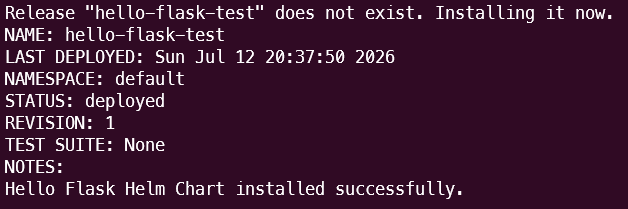
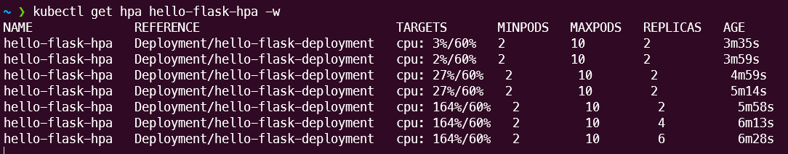
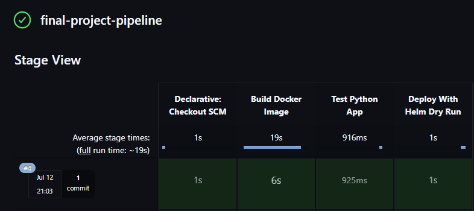

# DevOps Final Project

## Overview

This repository contains a complete DevOps project that demonstrates the process of containerizing, deploying, scaling, and automating a Python Flask application using modern DevOps tools.

The project demonstrates a complete workflow from application development and containerization to Kubernetes deployment and automatic scaling.

The project includes:

- Containerizing a Python Flask application with Docker.
- Deploying the application to Kubernetes using Helm.
- Managing application configuration using ConfigMap and Secret.
- Implementing health checks using Liveness and Readiness Probes.
- Implementing Horizontal Pod Autoscaling (HPA) based on CPU utilization.
- Automating build, application validation, and Helm deployment validation using Jenkins.

---

## Technologies Used

| Technology | Purpose |
|---|---|
| Python | Application development |
| Flask | Web application framework |
| Git & GitHub | Version control |
| Docker | Application containerization |
| Docker Compose | Local container management |
| Kubernetes | Container orchestration |
| Minikube | Local Kubernetes cluster |
| Helm | Kubernetes package management |
| Jenkins | CI/CD automation |

---

## Project Workflow

```text
Python Flask Application
          │
          ▼
       Docker
          │
          ▼
     Docker Image
          │
          ▼
      Helm Chart
          │
          ▼
      Kubernetes
          │
          ├── Deployment
          ├── Service
          ├── ConfigMap
          ├── Secret
          ├── CronJob
          └── HPA
                 │
                 ▼
        Automatic Pod Scaling
```

---

## Repository Structure

```text
Final_Project/
│
├── app/
│   ├── Dockerfile
│   ├── docker-compose.yml
│   ├── hello_world.py
│   ├── requirements.txt
│   └── README.md
│
├── helm/
│   └── hello-flask-chart/
│       ├── .helmignore
│       ├── Chart.yaml
│       ├── values.yaml
│       ├── README.md
│       └── templates/
│           ├── configmap.yml
│           ├── cronjob.yml
│           ├── deployment.yml
│           ├── hpa.yml
│           ├── secret.yml
│           ├── service.yml
│           └── NOTES.txt
│
├── docs/
│   └── images/
│       ├── helm-deployment.png
│       ├── hpa-scaling.png
│       └── jenkins-pipeline.png
│
├── Jenkinsfile
├── README.md
└── .gitignore
```

---

## Application

The Python Flask application provides the following endpoints:

| Endpoint | Purpose |
|---|---|
| `/` | Returns the application response |
| `/health` | Health check used by Kubernetes probes |
| `/load` | Generates CPU load for HPA testing |

The `/load` endpoint performs CPU-intensive calculations to demonstrate automatic scaling based on CPU utilization.

For detailed application and Docker instructions, see `app/README.md`.

---

## Helm and Kubernetes

The application is deployed to Kubernetes using a reusable Helm chart.

The Helm chart creates the following Kubernetes resources:

- Deployment
- Service
- ConfigMap
- Secret
- CronJob
- Horizontal Pod Autoscaler (HPA)

The Deployment includes:

- CPU resource requests
- CPU resource limits
- Liveness Probe
- Readiness Probe

Both probes use the `/health` application endpoint.

The HPA scales the application between 2 and 10 replicas based on a target CPU utilization of 60%.

### Helm Deployment

The application was successfully deployed to Kubernetes using Helm.



For detailed deployment and HPA testing instructions, see `helm/hello-flask-chart/README.md`.

---

## Quick Start

### 1. Start Minikube

```bash
minikube start
```

### 2. Enable Metrics Server

```bash
minikube addons enable metrics-server
```

### 3. Deploy the Application

From the `helm` directory:

```bash
helm upgrade --install hello-flask-test ./hello-flask-chart
```

### 4. Verify the Pods

```bash
kubectl get pods
```

### 5. Access the Application

```bash
minikube service hello-flask-service --url
```

### 6. Generate CPU Load

```bash
curl <APPLICATION_URL>/load
```

### 7. Monitor HPA Scaling

```bash
kubectl get hpa -w
```

---

## Horizontal Pod Autoscaling

The application uses Kubernetes Horizontal Pod Autoscaling based on CPU utilization.

During testing, CPU utilization increased above the configured 60% target and reached 164%.

The HPA automatically scaled the Deployment from 2 replicas to 6 replicas.

### HPA Scaling Demonstration



---

## Jenkins Pipeline

The Jenkins pipeline automates the project validation process.

The pipeline performs the following stages:

1. Checks out the source code from Git.
2. Builds the Docker image.
3. Verifies the Python application.
4. Validates the Helm chart using a dry-run deployment.

### Successful Pipeline Execution

The complete Jenkins pipeline was successfully executed with all stages completed successfully.



---

---

## Documentation

Detailed documentation is available in:

- `app/README.md` – Application and Docker instructions.
- `helm/hello-flask-chart/README.md` – Helm deployment, Kubernetes resources, and HPA testing guide.

---

## Author

Dana Lisagor

GitHub: DanaLisagor